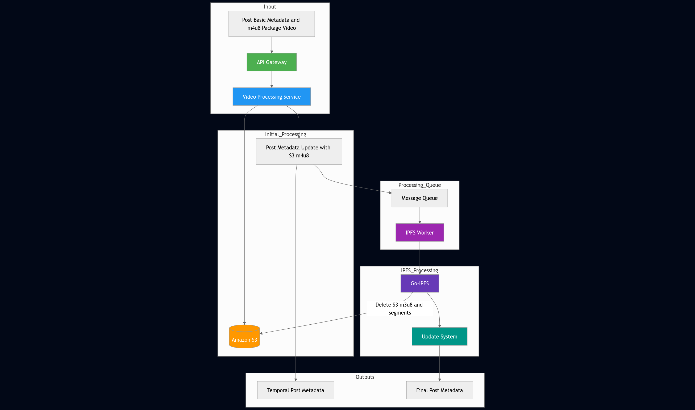

Here's a detailed description of the system flow shown in your diagram:

### 1. **Input Stage** (Green Components)
- **User Upload**: 
  - Content creators submit two elements:
    - Basic post metadata (JSON format)
    - Video package using m4u8 format (HLS streaming format with segmented video files)
- **API Gateway**: 
  - Receives and validates uploads through RESTful endpoints
  - Routes data to Video Processing Service

### 2. Initial Processing (Blue/Orange)
- **Video Processing Service**:
  1. **Segmentation**: 
     - Splits m4u8 package into individual video segments
     - Stores each segment in Amazon S3 with unique Content ID (CID)
  2. **Metadata Update**:
     - Reconstructs m4u8 manifest with S3 CIDs
     - Updates original JSON metadata with S3 references
     ```json
     // Example metadata update
     "video_assets": {
         "s3_m3u8": "s3://bucket/video_123/master.m3u8",
         "segments": [
             "s3://bucket/video_123/seg1.ts",
             "s3://bucket/video_123/seg2.ts"
         ]
     }
     ```

### 3. Queue Processing (Purple)
- **Message Queue**:
  - Uses RabbitMQ/Amazon SQS for asynchronous processing
  - Ensures reliable delivery of processing tasks
- **IPFS Worker**:
  - Dedicated microservice that:
    - Pulls tasks from queue
    - Coordinates IPFS processing
    - Manages error handling

### 4. IPFS Processing (Indigo)
- **Go-IPFS Integration**:
  1. Uploads video segments to IPFS network
  2. Generates new IPFS CIDs for all assets
  3. Creates updated m3u8 manifest with IPFS references
  ```go
  // Example IPFS CID generation
  ipfs add video_segment.ts
  > added QmXoypizjW3WknFiJnKLwHCnL72vedxjQkDDP1mXWo6uco
  ```
- **Update System**:
  - Maintains final metadata version
  - Implements CID replacement strategy:
    ```diff
    - "s3://bucket/video_123/seg1.ts"
    + "ipfs://QmXoy...6uco"
    ```

### 5. Output Management (Green Components)
- **Immediate Output**:
  - Returns temporary JSON with S3 references within 2-5 seconds
  ```json
  {
      "status": "processing",
      "s3_manifest": "s3://...",
      "estimated_completion": "2025-05-05T15:05:00Z"
  }
  ```
- **Final Output**:
  - Stores IPFS-enabled JSON in database
  - Implements cleanup process:
    ```sql
    DELETE FROM temp_storage WHERE cid = 's3://...'
    ```

### Data Flow Timeline
| Stage | Duration | Data Transformation |
|-------|----------|---------------------|
| 1. Upload | 100-500ms | Raw → Encapsulated |
| 2. S3 Processing | 1-3s | Segmented + Indexed |
| 3. Queueing | <100ms | Task Serialization |
| 4. IPFS Processing | 10-30s | Distributed Storage |
| 5. Finalization | 500ms | Atomic Update |

### Key Design Features
1. **Dual Storage Strategy**:
   - S3 for fast initial access
   - IPFS for permanent decentralized storage

2. **Automatic Cleanup**:
   - S3 assets automatically removed after IPFS confirmation
   - Cost optimization through lifecycle policies

3. **Metadata Versioning**:
   - Maintains both storage versions for audit purposes
   - Enables cross-platform compatibility


